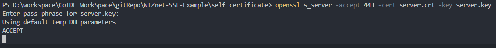

# WIZnet-SSL-Example
WIZnet SSL example for W5100S

이 repo에서는 WIZnet IC(W5100S) + STM32F103VC 환경에서 SSL/TLS Loopback을 구현한 예제입니다.

## 개발 환경
- 개발 보드 : W5100S EVB ([http://wizwiki.net/wiki/doku.php?id=products:w5100s:w5100s_evb:start](http://http://wizwiki.net/wiki/doku.php?id=products:w5100s:w5100s_evb:start))
 - W5100S + STM32F103VC
- IDE: COIDE 1.7.8 (더 이상 다운로드 받을 수 없습니다. 최대한 코드만 참고하시기 바랍니다.)
- SSL library: mbedtls 2.8.? ([https://tls.mbed.org/](http://https://tls.mbed.org/))
이미지

## 테스트
1. 테스트 서버 구성
self certificate 폴더에 있는 "openssl self signed certificate 생성 및 임시 서버 구동" 문서를 참고하여 SSL 서버를 구동합니다.

2. W5100S EVB 준비
테스트 서버와 통신할 수 있도록 W5100S EVB의 네트워크 정보를 코드 수정을 통해 구성하고 컴파일한 후 펌웨어를 업로드 합니다.
main.c의 22번째 줄에서 수정할 수 있습니다.
<code>
	wiz_NetInfo defaultNetInfo = { .mac = {0x00,0x08,0xdc,0xff,0xee,0xdd},
							.ip = {192,168,128,128},
							.sn = {255,255,255,0},
							.gw = {192,168,128,1},
							.dns = {168, 126, 63, 1},
							.dhcp = NETINFO_STATIC};
	unsigned char gServer_IP[4] = {192,168,128,244};
</code>

이미지
3. 테스트 구성 및 결과 확인
테스트 서버와 프로그램된 W5100S EVB를 같은 네트워크에 연결하고 USB를 통해 전원을 연결합니다.
W5100S EVB는 USB to Serial 기능이 있고 이 예제는 Serial 툴을 통해 디버그 메세지를 볼 수 있도록 프로그램되어 있습니다.
이미지
정상적으로 연결되었다면 SSL 서버에서 아무 문자나 입력한 후 엔터키를 눌러 메세지를 전달하면 W5100S EVB가 받아 다시 그 값을 되돌려 줍니다.
이미지

## 기타
Self signed certificate를 직접 만들고 싶다면 self certificate 폴더에 있는 "openssl self signed certificate 생성 및 임시 서버 구동" 문서를 참고하시기 바랍니다.

그 외 기타 궁금한 사항은 peter@wiznet.io로 연락바랍니다.

감사합니다.
